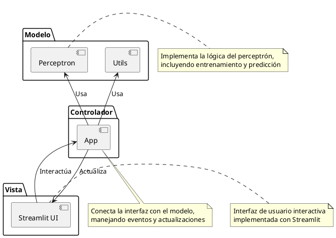

# Perceptrón Simple - Documentación

Bienvenido a la documentación del proyecto de Perceptrón Simple para Inteligencia Artificial.

## Descripción

Este proyecto implementa un perceptrón simple para clasificación binaria. El perceptrón es uno de los modelos más básicos de redes neuronales y es capaz de resolver problemas linealmente separables.

## Arquitectura

La arquitectura del proyecto sigue el patrón Modelo-Vista-Controlador (MVC):

## Componentes principales

### Módulo `perceptron.py`

Implementa la clase `Perceptron` con los siguientes métodos principales:

- `predict`: Realiza predicciones para un conjunto de datos.
- `train_epoch`: Entrena el perceptrón durante una época.
- `fit`: Entrena el perceptrón hasta convergencia o un número máximo de épocas.

### Aplicación Streamlit (`app.py`)

Proporciona una interfaz gráfica interactiva que permite:

- Configurar parámetros iniciales (pesos, umbral, tasa de aprendizaje)
- Seleccionar problemas predefinidos (AND, OR, etc.)
- Visualizar el proceso de entrenamiento y los resultados
- Explorar la frontera de decisión

### Utilidades (`utils.py`)

Contiene funciones auxiliares para:

- Generación de conjuntos de datos
- Visualización de resultados
- Evaluación del rendimiento

## Instalación y uso

Para instrucciones detalladas sobre la instalación y uso, consulta la [Guía de Usuario](guia-usuario.md). 